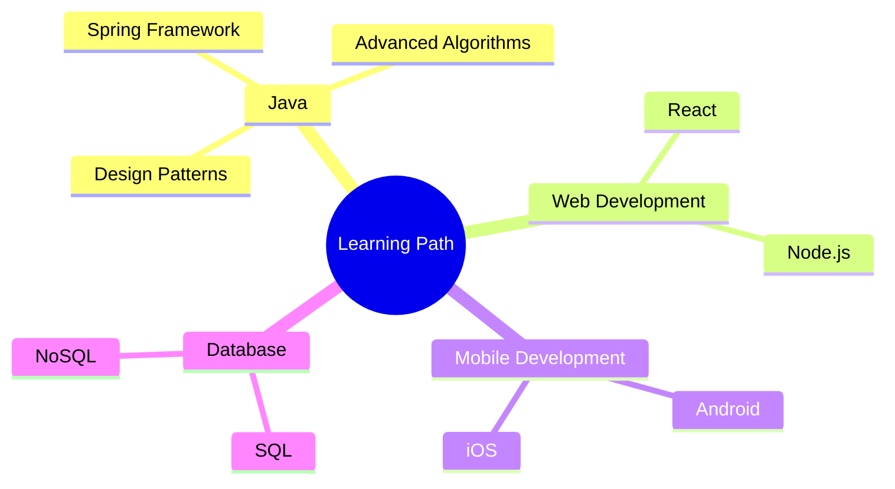

  
  # 👋 Hi there, I'm Marino Barić

  

  

  
  
  
   
  
   
   
  

  

---

## 🚀 About Me

🎓 **Education:** Student at RIT Croatia studying Web and Mobile Computing.

💻 **Currently:** Mastering Java and exploring its ecosystem.

🔍 **Previously:** Developed skills in Python and worked with various frameworks and libraries.

⚡ **Passion:** Coding, solving complex problems, and creating efficient software solutions.

📚 **Philosophy:** I believe in continuous learning and staying updated with emerging technologies.

---

## 💼 Skills & Technologies

  
### Languages

### Frameworks & Libraries

### Tools

  

---

## 📊 GitHub Stats

  
  

  

---

## 🌟 Featured Projects

  
  
  
  

---

## 🎯 Current Focus

---

## 📫 How to Reach Me

  
  
  
  

---

  

  <h3>💭 "Code is like humor. When you have to explain it, it's bad." — Cory House</h3>

